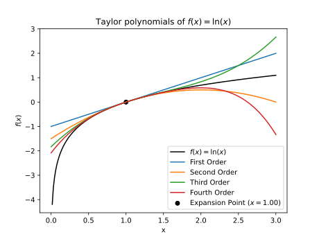

# Report

## Part 1

**1.1 Briefly summarize how you computed the discharge from the concentration measurements and present your result.
Include the code line(s) that implement the numerical integration.**


% solution_start

We computed the discharge $Q$ from the injected solute mass $m$ and the area under the concentration curve $A$ as follows:

$$Q = \frac{m}{\int_0^{t_{\text{end}}} c(t) dt} = \frac{m}{A}$$

We approximated the integral of the concentration curve using the trapezoidal rule:

$$A = \int_0^{t_{\text{end}}} c(t) dt \approx \sum_{i=0}^{n-1} \frac{c(t_i) + c(t_{i+1})}{2} \Delta t_i$$

In the code, this is implemented as follows:

```{python}
trapezoid_areas = (concentration[:-1] + concentration[1:]) / 2 * dt
total_area_trapz = np.sum(trapezoid_areas)
```

This yields an area of 34.8 mg/L·s. With an injected mass of 200 g, the discharge is 5.7 L/s.

% solution_end

**1.2 Justify your choice of numerical integration method, taking theoretical and practical considerations into account.**

% solution_start

For the dataset, the trapezoidal rule is a suitable integration technique.
For a given number of integration points, it (theoretically) has a lower error compared to the left and right Riemann sum.

While Simpson's rule would have an even lower error, it requires equally spaced measurement intervals which are not available for this data set.
The error of the midpoint rule scales with the size of integration intervals in the same way as for the trapezoidal rule.
However, it requires evaluating the function at the midpoint of each interval which is is not possible with fixed measurements.

Note, however, that for this data set the differences between the integration methods are actually all small. Experimental and measurement inaccuracies will be more important for the final discharge estimate than the choice of numerical integration technique.

% solution_end

**1.3 Paste the plot that you created in task 1.4. How many points would you choose for integrating the simulated concentration curve with Simpson's rule? Justify your answer.**

% solution_start

With few integration intervals (less than ten), the result strongly changes with the number of intervals, indicating large integration errors.
At around 20 intervals, the solution stabilizes and does not change considerably anymore.
Thus, 20 integration intervals seems to be a reasonable choice to achieve accurate results while avoiding unnecessary computational costs.

% solution_end

## Part 2

**2.1 What is the expression for the 4th order Taylor polynomial of $\ln(x)$ around $x_0 = 1$? You can copy a picture of your solution from task 2.1 (or type the solution in Markdown format).**

% solution_start

The first four derivatives of $f(x) = \ln(x)$ are:
$$f^\prime(x) = \frac{1}{x}$$
$$f^{\prime\prime}(x) = -\frac{1}{x^2}$$
$$f^{\prime\prime\prime}(x) = \frac{2}{x^3}$$
$$f^{\prime\prime\prime\prime}(x) = -\frac{6}{x^4}$$

In general,the $n$ th derivative is:
$$f^{(n)}(x) = (-1)^{n+1} (n-1)! \,x^{-n}$$

If we evaluate the derivative at $x_0=1$, we obtain:

$$f^\prime(1) = 1$$
$$f^{\prime\prime}(1) = -1$$
$$f^{\prime\prime\prime}(1) = 2$$
$$f^{\prime\prime\prime\prime}(1) = -6$$

The first four terms of the Taylor series around $x_0=1$ are:

$$
\begin{aligned}
f(x) &=  f(x_0) + (x-x_0)f'(x_0)+\frac{(x-x_0)^2}{2!}f''(x_0)+ \frac{(x-x_0)^3}{3!} f'''(x_0)+ \frac{(x-x_0)^4}{4!} f''''(x_0)+ ...\\
&= 0 + (x-1) \cdot 1 + \frac{(x-1)^2}{2!}\cdot (-1) + \frac{(x-1)^3}{3!}\cdot 2 + \frac{(x-1)^4}{4!}\cdot (-6) + \dots\\
&= (x-1) - \frac{(x-1)^2}{2} + \frac{(x-1)^3}{3} - \frac{(x-1)^4}{4} + \dots
\end{aligned}
$$

% solution_end

**2.2 Paste your plot of the Taylor approximations of $\ln(x)$ (output of task 2.5).**

% solution_start



% solution_end


**2.3 How well do the Taylor polynomials approximate the function $\ln(x)$? Consider the influence of the order of the polynomial and the value of $x$ in your answer.**


% solution_start

Very close to the expansion point, all Taylor polynomials (1st to 4th order) provide a reasonable approximation of $\ln(x)$. The closer to the expansion point, the better the approximation is (for all polynomial orders).

However, the linear approximation quickly deviates from the curve.
With increasing order of the polynomial, the approximation gets better, as long as we don't move too far away from the expansion point.

Beyond a certain distance from the expansion point, however, all polynomials deviate from the line of $\ln(x)$.
The higher-order polynomials then even have a larger absolute error than the lower-order approximation.
In fact, the Taylor series for $\ln(x)$ diverges for $x>2$, so adding more terms to the approximation does not help.

This shows that the Taylor polynomials provide a local approximation that only works well in the neighborhood of the expansion point.

% solution_end

## Part 3

**3.1 Copy your derivation from task 3.1 here (as a picture or in Markdown format).**

% solution_start

For backward differences we evaluate the Taylor series around $x_i$ at $x_{i−1}$ and $x_{i−2}$.
To end up with a second-order accurate expression, we need to include terms at least up to $n=2$.
This yields the following Taylor approximations:
    
$$f(x_{i-1})\approx f(x_{i})+(x_{i-1}-x_i)\frac{\partial f(x_{i})}{\partial x} +\frac{(x_{i-1}-x_i)^2}{2}\frac{\partial^2 f(x_i)}{\partial x^2}+\mathcal{O}((x_{i-1}-x_i)^3)$$
$$f(x_{i-2})\approx f(x_{i})+(x_{i-2}-x_i)\frac{\partial f(x_{i})}{\partial x} +\frac{(x_{i-2}-x_i)^2}{2}\frac{\partial^2 f(x_i)}{\partial x^2}+\mathcal{O}((x_{i-2}-x_i)^3)$$

    
We set $\Delta x = x_i - x_{i-1}$ for all $i$, which also means: $2\Delta x = x_i-x_{i-2}$
    
$$f(x_{i-1})\approx f(x_{i})-\Delta x\frac{\partial f(x_{i})}{\partial x} +\frac{\Delta x^2}{2}\frac{\partial^2 f(x_i)}{\partial x^2}+\mathcal{O}(\Delta x^3)$$
$$f(x_{i-2})\approx f(x_{i})-2\Delta x\frac{\partial f(x_{i})}{\partial x} +\frac{4\Delta x^2}{2}\frac{\partial^2 f(x_i)}{\partial x^2}+\mathcal{O}(\Delta x^3)$$
    
To get rid of the term including the second derivative, we multiply the first expression by 4 and subtract the second expression:
    
$$
\begin{aligned}
4f(x_{i-1})-f(x_{i-2})&\approx (4-1)f(x_{i})-(4-2)\Delta x\frac{\partial f(x_{i})}{\partial x} + (4-4)\frac{\Delta x^2}{2}\frac{\partial^2 f(x_i)}{\partial x^2}+\mathcal{O}(\Delta x^3)\\
&= 3f(x_{i})-2\Delta x\frac{\partial f(x_{i})}{\partial x} + \mathcal{O}(\Delta x^3)
\end{aligned}
$$

Bring the derivative to the left side and all terms involving $f(x)$ to the right side:
$$ 2\Delta x\frac{\partial f(x_{i})}{\partial x} \approx 3f(x_i)-4f(x_{i-1})+f(x_{i-2}) +\mathcal{O}(\Delta x^3)$$

Divide by $2 \Delta x$:

$$\frac{\partial f(x_{i})}{\partial x} \approx \frac{3f(x_i)-4f(x_{i-1})+f(x_{i-2})}{2\Delta x} +\mathcal{O}(\Delta x^2)$$

Note how the order of the error changes because we divide by $\Delta x$.
The final expression is second-order accurate.

% solution_end

> By Anna Störiko, Ronald Brinkgreve, Delft University of Technology. CC BY 4.0, more info [on the Credits page of Workbook](https://mude.citg.tudelft.nl/workbook-2025/credits.html).
